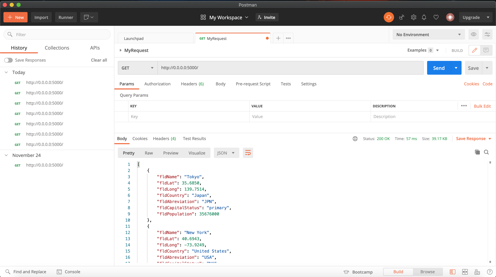
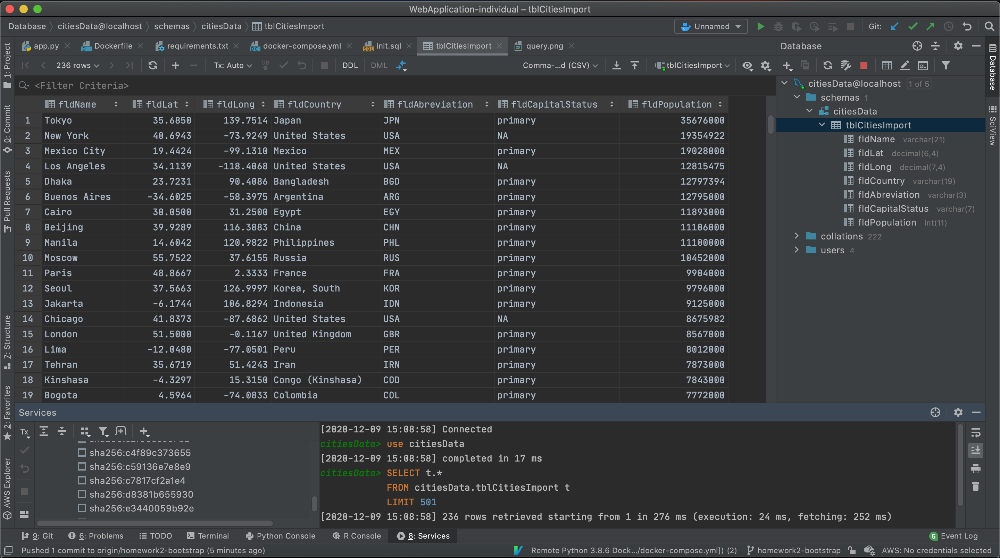

# Project Description
This project is a homework assignment to teach how to get Pycharm setup with Docker, Flask, MySQL.

## Homework 2 submission screenshots: 
 
# Postman Screenshot

# SQL Database Screenshot

